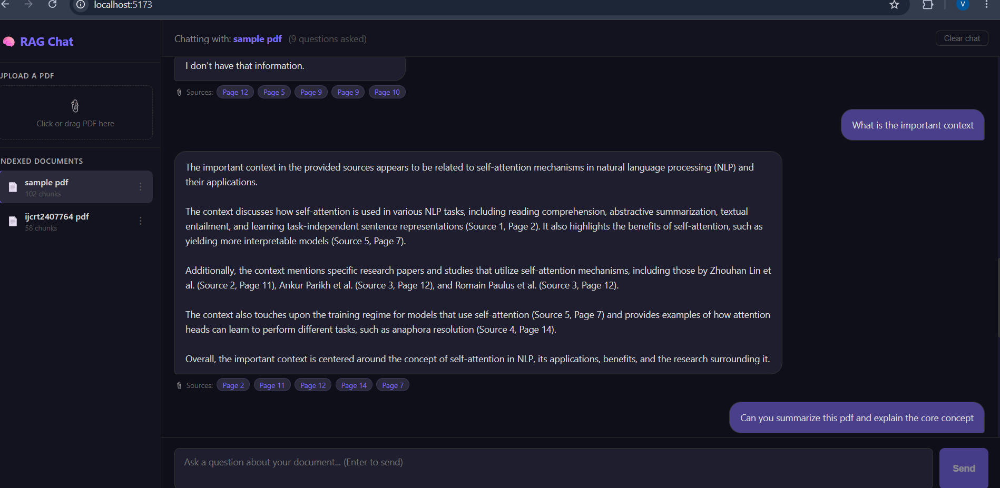

# 📄 RAG Chat — AI Document Q&A System

A full-stack Retrieval-Augmented Generation (RAG) application that lets you upload PDF documents and ask questions about them using natural language.

## 🎥 Demo
<!-- Add a screenshot or GIF here after deployment -->


## 🏗️ Architecture

```
User Question
     ↓
React Frontend (Vite)
     ↓ HTTP
FastAPI Backend
     ↓
HyDE Query Expansion ← generates hypothetical answer
     ↓
Multi-Query Retrieval ← 4 query variants searched
     ↓
ChromaDB Vector Search ← cosine similarity
     ↓
Groq LLM (Llama 3.3 70B) ← grounded answer generation
     ↓
Answer + Page Citations
```

## ✨ Features

- 📤 PDF upload with drag-and-drop
- 🔍 Semantic search using sentence embeddings
- 🧠 HyDE (Hypothetical Document Embeddings) for better retrieval
- 💬 Per-document persistent chat history
- 📎 Source citations with page numbers
- 🗂️ Multiple document management
- 🌙 Dark mode UI

## 🛠️ Tech Stack

| Layer | Technology |
|-------|-----------|
| Frontend | React, Vite, Axios |
| Backend | FastAPI, Python |
| Vector DB | ChromaDB |
| Embeddings | sentence-transformers (all-MiniLM-L6-v2) |
| LLM | Groq API (Llama 3.3 70B) |
| PDF Processing | PyMuPDF |
| Chat History | SQLite + SQLAlchemy |
| Text Splitting | LangChain RecursiveCharacterTextSplitter |

## 🚀 Getting Started

### Prerequisites
- Python 3.11+
- Node.js 18+
- Groq API key (free at console.groq.com)

### Backend Setup

```bash
# Clone the repo
git clone https://github.com/yourusername/rag-chat.git
cd rag-chat

# Create virtual environment
python -m venv .venv
.venv\Scripts\activate  # Windows
source .venv/bin/activate  # Mac/Linux

# Install dependencies
pip install -r requirements.txt

# Create .env file
echo "GROQ_API_KEY=your_key_here" > .env

# Start backend
uvicorn main:app --reload
```

### Frontend Setup

```bash
cd frontend
npm install
npm run dev
```

Visit `http://localhost:5173`

## 📁 Project Structure

```
rag-chat/
├── main.py              # FastAPI application
├── pipeline.py          # RAG pipeline (HyDE + retrieval)
├── database.py          # SQLite chat history
├── requirements.txt
├── .env
├── uploads/             # uploaded PDFs
├── chroma_data/         # vector embeddings
└── frontend/
    ├── src/
    │   ├── App.jsx
    │   ├── hooks/
    │   │   └── useChat.js
    │   ├── api/
    │   │   └── ragApi.js
    │   └── components/
    │       ├── Sidebar.jsx
    │       ├── Header.jsx
    │       ├── ChatWindow.jsx
    │       ├── ChatInput.jsx
    │       ├── FileUpload.jsx
    │       └── DocumentList.jsx
    └── package.json
```

## 🔌 API Endpoints

| Method | Endpoint | Description |
|--------|----------|-------------|
| POST | `/upload` | Upload and index a PDF |
| POST | `/query` | Ask a question about a document |
| GET | `/documents` | List all indexed documents |
| DELETE | `/documents/{name}` | Delete a document |
| GET | `/history/{session}/{collection}` | Get chat history |
| POST | `/history` | Save a chat message |
| DELETE | `/history/{session}/{collection}` | Clear chat history |

## 🧠 How RAG Works

1. **Indexing** — PDF is split into 500-char chunks with 100-char overlap
2. **Embedding** — Each chunk converted to 384-dim vector using MiniLM
3. **Storage** — Vectors stored in ChromaDB with page metadata
4. **HyDE** — User question → LLM generates hypothetical answer → embed that
5. **Retrieval** — Top-5 most similar chunks fetched via cosine similarity
6. **Generation** — Groq LLM reads chunks and generates grounded answer

## 🔮 Future Improvements

- [ ] Hybrid search (BM25 + vector)
- [ ] Multi-document cross-search
- [ ] User authentication
- [ ] Docker deployment
- [ ] Streaming responses
- [ ] Support for DOCX, TXT files

## 📄 License
MIT